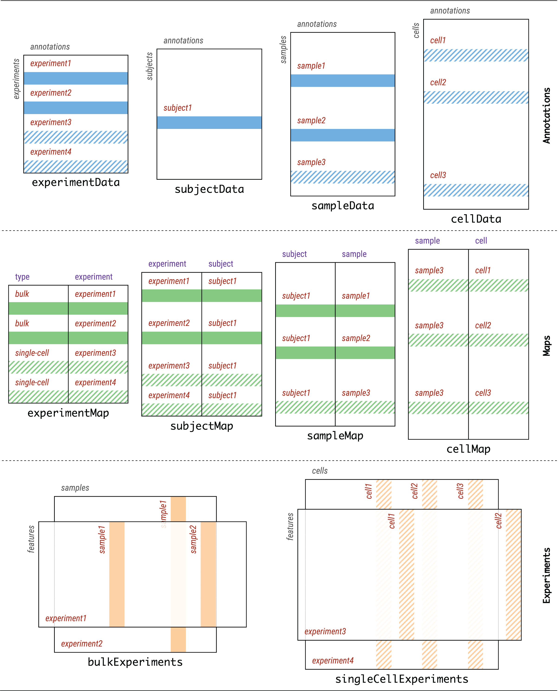

```{r, include = FALSE}
library(MultimodalExperiment)
```

# Introduction

MultimodalExperiment is an S4 class that integrates bulk and single-cell experiment data; it is optimally storage-efficient and its methods are exceptionally fast. It effortlessly represents multimodal data of any nature and features normalized experiment, subject, sample, and cell annotations which are related to underlying biological data through maps. Its coordination methods are opt-in and employ database-like join operations internally to deliver fast and flexible management of multimodal data.

```{r figure-one, echo = FALSE, fig.cap = "MultimodalExperiment Schematic. Lorem ipsum dolor sit amet, consectetur adipiscing elit. Donec eget ligula libero. Nunc efficitur, metus vel convallis vulputate, metus nunc tristique felis, in condimentum arcu odio at sapien. Vestibulum eu euismod risus, mollis lobortis purus. Praesent porttitor finibus augue, sed suscipit urna venenatis at.", fig.wide = TRUE}

```

Lorem ipsum dolor sit amet, consectetur adipiscing elit. Donec eget ligula libero. Nunc efficitur, metus vel convallis vulputate, metus nunc tristique felis, in condimentum arcu odio at sapien. Vestibulum eu euismod risus, mollis lobortis purus. Praesent porttitor finibus augue, sed suscipit urna venenatis at.

|                                                           |                                                                                  |
|:----------------------------------------------------------|:---------------------------------------------------------------------------------|
| **Constructors**                                          |                                                                                  |
| &nbsp;&nbsp;&nbsp;&nbsp;`MultimodalExperiment`            | construct a MultimodalExperiment object                                          |
| &nbsp;&nbsp;&nbsp;&nbsp;`ExperimentList`                  | construct an ExperimentList object                                               |
| **Slots**                                                 |                                                                                  |
| &nbsp;&nbsp;&nbsp;&nbsp;`experimentData`                  | get or set experimentData (experiment annotations)                               |
| &nbsp;&nbsp;&nbsp;&nbsp;`subjectData`                     | get or set subjectData (subject annotations)                                     |
| &nbsp;&nbsp;&nbsp;&nbsp;`sampleData`                      | get or set sampleData (sample annotations)                                       |
| &nbsp;&nbsp;&nbsp;&nbsp;`cellData`                        | get or set cellData (cell annotations)                                           |
| &nbsp;&nbsp;&nbsp;&nbsp;`experimentMap`                   | get or set experimentMap (experiment -> type map)                                |
| &nbsp;&nbsp;&nbsp;&nbsp;`subjectMap`                      | get or set subjectMap (subject -> experiment map)                                |
| &nbsp;&nbsp;&nbsp;&nbsp;`sampleMap`                       | get or set sampleMap (sample -> subject map)                                     |
| &nbsp;&nbsp;&nbsp;&nbsp;`cellMap`                         | get or set cellMap (cell -> sample map)                                          |
| &nbsp;&nbsp;&nbsp;&nbsp;`experiments`                     | get or set experiments                                                           |
| &nbsp;&nbsp;&nbsp;&nbsp;`metadata`                        | get or set metadata                                                              |
| **Annotations**                                           |                                                                                  |
| &nbsp;&nbsp;&nbsp;&nbsp;`joinAnnotations`                 | join experimentData, subjectData, sampleData, and cellData                       |
| **Maps**                                                  |                                                                                  |
| &nbsp;&nbsp;&nbsp;&nbsp;`joinMaps`                        | join experimentMap, subjectMap, sampleMap, and cellMap                           |
| **Experiments**                                           |                                                                                  |
| &nbsp;&nbsp;&nbsp;&nbsp;`experiment(ME, i)`               | get or set experiments element by index                                          |
| &nbsp;&nbsp;&nbsp;&nbsp;`experiment(ME, "name")`          | get or set experiments element by name                                           |
| &nbsp;&nbsp;&nbsp;&nbsp;`bulkExperiments`                 | get or set experiments element(s) where `type == "bulk"`                         |
| &nbsp;&nbsp;&nbsp;&nbsp;`singleCellExperiments`           | get or set experiments element(s) where `type == "single-cell"`                  |
| **Names**                                                 |                                                                                  |
| &nbsp;&nbsp;&nbsp;&nbsp;`rownames`                        | get or set rownames of experiments element(s)                                    |
| &nbsp;&nbsp;&nbsp;&nbsp;`colnames`                        | get or set colnames of experiments element(s)                                    |
| &nbsp;&nbsp;&nbsp;&nbsp;`experimentNames`                 | get or set names of experiments                                                  |
| **Subsetting**                                            |                                                                                  |
| &nbsp;&nbsp;&nbsp;&nbsp;`ME[i, j]`                        | subset rows and/or columns of experiments                                        |
| &nbsp;&nbsp;&nbsp;&nbsp;&nbsp;&nbsp;&nbsp;&nbsp;`ME[i, ]` | &nbsp;&nbsp;&nbsp;&nbsp;`i`: list, List, LogicalList, IntegerList, CharacterList |
| &nbsp;&nbsp;&nbsp;&nbsp;&nbsp;&nbsp;&nbsp;&nbsp;`ME[, j]` | &nbsp;&nbsp;&nbsp;&nbsp;`j`: list, List, LogicalList, IntegerList, CharacterList |
| **Coordination**                                          |                                                                                  |
| &nbsp;&nbsp;&nbsp;&nbsp;`propagate`                       | propagate experiment, subject, sample, and cell indices across all tables        |
| &nbsp;&nbsp;&nbsp;&nbsp;`harmonize`                       | harmonize experiment, subject, sample, and cell indices across all tables        |

Lorem ipsum dolor sit amet, consectetur adipiscing elit. Donec eget ligula libero. Nunc efficitur, metus vel convallis vulputate, metus nunc tristique felis, in condimentum arcu odio at sapien. Vestibulum eu euismod risus, mollis lobortis purus. Praesent porttitor finibus augue, sed suscipit urna venenatis at.

# Session Info

```{r}
sessionInfo()
```
